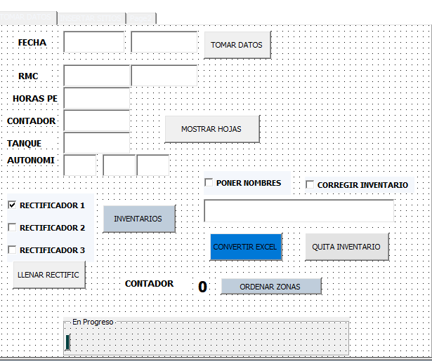
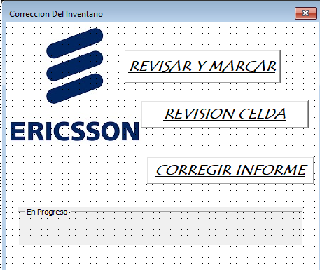
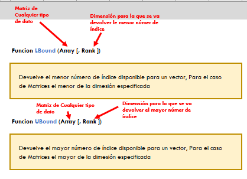

# Codigo para recordar
<div align="center">
   <h2> MACRO ERICSSON PREVENTIVOS </h2>
     
    
   <h2> MACRO ERICSSON CORRECION INVENTARIOS </h2>
       
   
  <small><p>Sistema de Control Local</p></small>  
  
  
</div>

## ARREGLOS O VECTORES
```
Sub Matriz()
    Dim avData As Variant
    Dim wkb As Workbook
    
    Dim i As Integer    
    avData = Array("Norte", "Sur", "Este", "Oeste")    
    For i = LBound(avData) To UBound(avData)
        Set wkb = Workbooks.Open(Filename:=avData(i) & ".xlsx")
        '        
        wkb.Close savechanges:=False     
        
    Next 
End Sub
```

